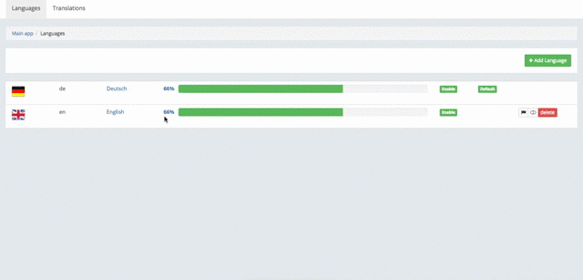

# Multilang

[](https://travis-ci.org/kelevro/multilang)

##### Multilang This gem provides a web interface for managing translations for your website

#### It allows:

* Search by key
* Search for text translation
* Adding and editing languages
* Adding and editing keys
* Remove language or key

## Install

install gem

```ruby
gem 'rails-i18n'
gem 'multilang', github: 'kelevro/multilang'
```
for using `redis` backend (optional)
```ruby
gem 'redis'
```

add to `routes.rb`

```ruby
mount Multilang::Engine => '/multilang'
```
if you need authorization

```ruby
authenticate :admin do
  mount Multilang::Engine => '/multilang'
end
```

create initializer

```ruby
rails g multilang:install
```

run migrations

```ruby
rake multilang:install:migrations
rake db:migrate
```

## Configure
In
`config/initializers/multilang.rb`
edit

`config.root_path` - url for return main app

`config.force_export` - if set `true` will export after each save translation

`config.backends` -   backends list. Available `[:file, :redis]`. `:file` - always enable

for example

```ruby
Multilang.configure do |config|
  config.root_path    = :admin_path
  config.force_export = true
  config.backends << :redis
end
```

#### Configure redis backend
For cofigure redis backend edit config file `config/multilang.yml`
for example
```yml
development: &default
  redis:
    host: 'localhost'
    port: 6379
    db: 0
    password: ''
    namespace: 'multilang'
test:
  <<: *default

production:
  <<: *default
```

## Usage



## Export translaitons keys

After adding translations to your locales files you can run

`rake multilang:pull path=config/locales`

after thet all your tralslations will be available in multilang console. If in console key already exists this key will be skip. If you want override translation in console you can run

`rake multilang:pull force`


`rake multilang:pull` - pull to console all translation from your project


## Export/Import translaitons keys with capistrano

add to `Capfile`:

`require 'multilang/capistrano'`

usage:

get locales `cap production multilang:get_locales`

set locales `cap production multilang:set_locales`

## TODO
* Remove Rails dependency
